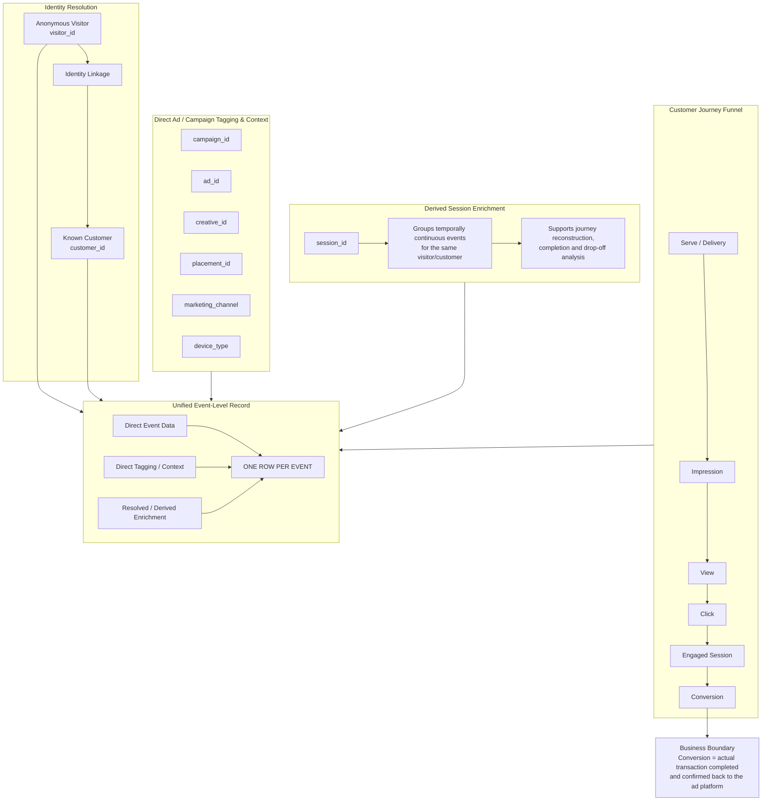

# Customer Ad Engagement — Semantic Workflow

> **Grain:** one row per engagement event (most detailed event-level data product).



## Semantic Blocks

### 1. Funnel Events

The event journey runs from ad delivery/exposure through engagement and ends at conversion. Not every visitor completes the journey; the event-level design preserves incomplete journeys and drop-off points rather than requiring a completed funnel.

### 2. Identity

Raw events retain an anonymous `visitor_id`. When identity resolution is available, the same event can be enriched with `customer_id` and identity-resolution metadata without changing the event grain.

### 3. Ad / Campaign Tagging

Campaign and ad identifiers attach marketing context directly to the interaction so engagement can later be connected to the relevant campaign, ad, creative, placement, and marketing channel.

### 4. Device / Channel Context

`device_type` describes the device on which the interaction occurred (for example, mobile or desktop). `marketing_channel` describes the marketing delivery context; these are separate business concepts.

### 5. Session

A session is a **derived grouping of temporally continuous events for the same visitor/customer**. It is used to reconstruct customer journeys, distinguish multiple independent visits, and evaluate journey completeness and drop-off even when the customer does not convert.

`session_id` does not define the grain and is not the primary conversion-attribution key. The data product remains one row per event; sessionization is an event-level enrichment derived from visitor/customer identity, event timestamps, and agreed inactivity rules.

### 6. Conversion Boundary

For this data product, `conversion` means an **actual transaction completed at the merchant and subsequently confirmed back to the advertising platform** through an available tracking/postback mechanism.

The conversion event marks the boundary of Customer Ad Engagement. Detailed transaction economics such as order amount, SKU, tax, refund, and merchant revenue remain outside this product and can be modeled separately.

## Event-Level Data Composition

```text
ONE ROW PER EVENT
=
DIRECT EVENT DATA
+
DIRECT TAGGING / CONTEXT
+
RESOLVED / DERIVED EVENT-LEVEL ENRICHMENT
```

No session-, customer-, campaign-, or daily-level aggregation is introduced in this product.
