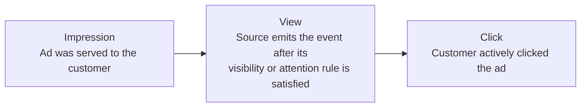
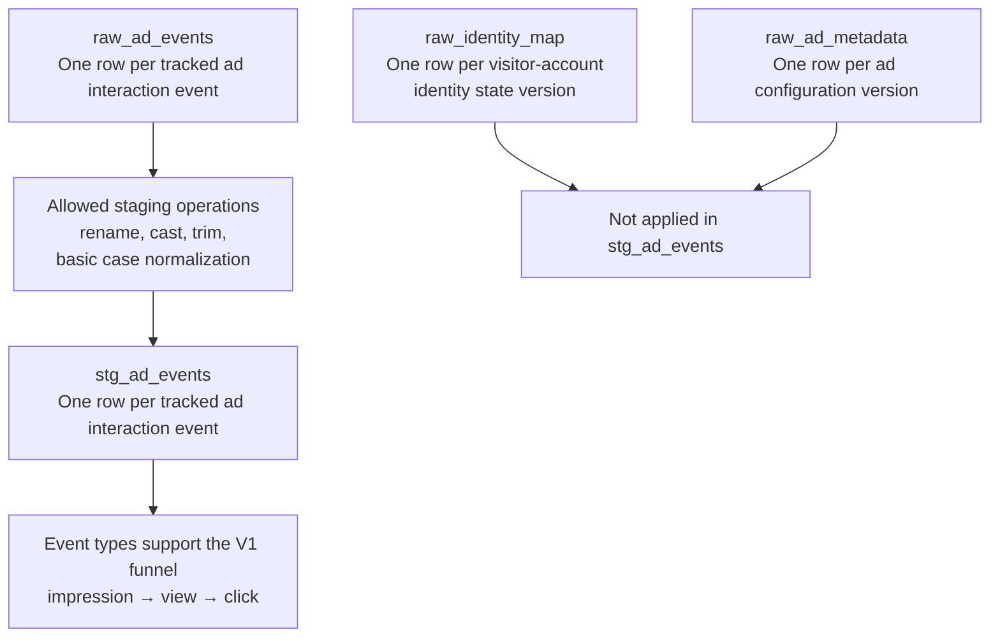

# Customer Ad Engagement — V1 Semantic Workflow

## Funnel

The V1 funnel is `impression → view → click`. A view is a directly emitted source event; it is not derived in staging. A platform rule may, for example, require the ad to remain visible for at least three seconds before emitting the event.

Conversion and transaction outcomes are outside the V1 workflow.

## Raw-to-Staging Workflow

`stg_ad_events` preserves the grain and columns of `raw_ad_events`, except that `raw_event_type` is renamed to `event_type`.

Identity resolution, sessionization, metadata enrichment, and aggregation do not occur in `stg_ad_events`. No downstream use of `raw_identity_map` or `raw_ad_metadata` is defined by the confirmed staging design.

See [`raw_source_design.md`](./raw_source_design.md) for the complete confirmed source inventories and staging mapping.
